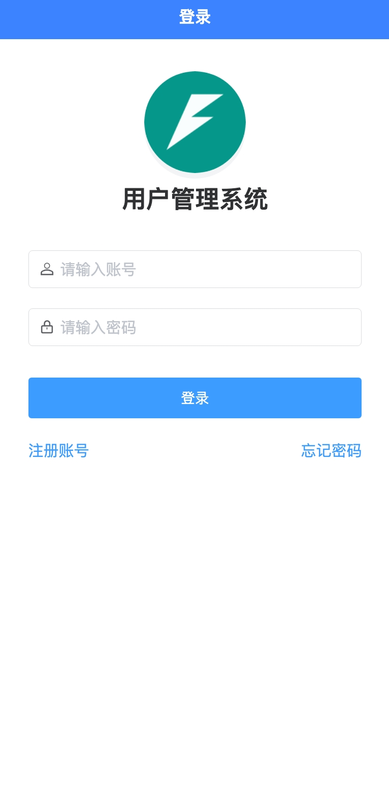
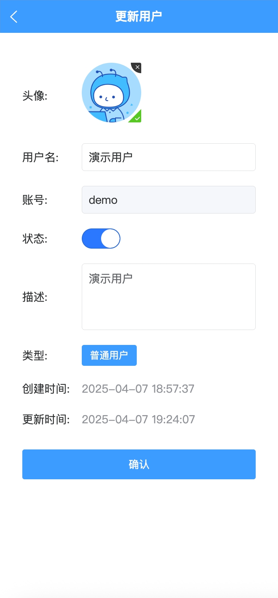
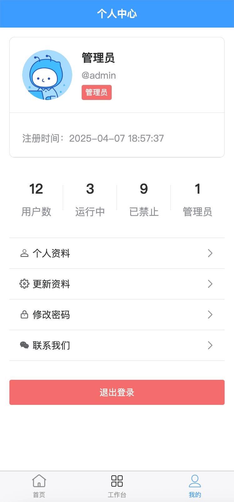

<div align="center">
   <p align="center">
      
   </p>
   <h1 align="center" style="margin: 30px 0 30px; font-weight: bold;">Fastapi_Vue3_App</h1>
   <h4 align="center">基于Fastapi-Vue3-App前后端分离的快速移动、小程序和H5应用开发框架</h4>
   <p align="center">
      <a href="https://gitee.com/tao__tao/fastapi_vue3_app.git">
         
      </a>
      <a href="https://github.com/1014TaoTao/fastapi_vue3_app.git">
         
      </a>
      <a href="https://gitee.com/tao__tao/fastapi_vue3_app/blob/master/LICENSE">
         
      </a>
      
   </p>
</div>

简体中文 | [English](./README.en.md)

## FastAPI-Vue3-App 项目简介

### 项目概述

FastAPI-Vue3-App 是全栈开源项目，旨在助开发者快速搭建移动、小程序和 H5 应用。后端采用 FastAPI + SQLModel + Alembic + JWT 异步编程提升并发，简化数据库操作，实现身份验证与授权，并进行管理版本；前端采用 Vue3 + Vite5 + Pinia + UniApp + uView-plus 实现快速构建，跨平台开发。提供一站式开发方案，高效便捷。

> 后端技术栈：

- **FastAPI**: 利用异步编程特性，提升应用的并发处理能力。
- **SQLModel**: 简单易用的ORM工具，简化数据库操作。
- **Alembic**: 数据库迁移工具，用于管理数据库版本。
- **JWT**: 用于身份验证和授权。

> 前端技术栈：

- **Vue3**: 渐进式JavaScript框架，用于构建用户界面。
- **Vite**: 快速的前端构建工具，支持热重载。
- **Pinia**: 状态管理工具，用于管理前端状态。
- **UniApp**: 跨平台应用开发框架，支持多端开发。
- **uView-plus**: 基于Vue3的UI组件库，提供丰富的组件。

### 主要特性

- **快速上手**: 提供完整的项目结构和示例代码，减少初期配置时间。
- **模块化设计**: 各个组件独立开发，便于维护和扩展。
- **文档齐全**: 详细的README文档和API文档，方便学习和参考。
- **社区支持**: 完全开源，欢迎提交问题和Pull Request。

### 目录结构

```sh
fastapi_vue3_app/
├─ backend        # 后端目录
├─ frontend       # 前端目录
├─ README.en.md   # 英文文档
└─ README.md      # 中文文档
```

### 页面展示

<table>
    <tr>
        <td>登陆</td>
        <td>注册</td>
        <td>忘记密码</td>
        <td>首页</td>
   </tr>
   <tr>
        <td>工作台</td>
        <td>新增用户</td>
        <td>更新用户</td>
        <td>用户详情</td>
   </tr>
    <tr>
        <td>个人中心</td>
        <td>个人中心</td>
        <td>联系我们</td>
   </tr>
</table>

### 快速开始

- 1、克隆项目

  - git clone <https://gitee.com/tao__tao/fastapi_vue3_app.git>

- 2、安装依赖：

  - cd fastapi_vue3_app/backend
  - pip install -r requirements.txt

- 3、启动项目：（1、生成迁移 2、升级迁移 3、运行项目）

  - python3 main.py revision
  - python3 main.py upgrade
  - python3 main.py run

- 4、访问项目：
  
  - 前端地址：<http://127.0.0.1:5180>
  - 账号：`admin` 密码：`123456`
  - 接口地址：<http://127.0.0.1:8000/docs>

### 特别鸣谢

感谢以下项目的贡献和支持，使本项目得以顺利完成：

- [FastAPI 项目](https://github.com/fastapi/fastapi)
- [SqlModel 项目](https://github.com/fastapi/sqlmodel)
- [Alembic 项目](https://github.com/sqlalchemy/alembic)
- [PyJWT 项目](https://github.com/jpadilla/pyjwt)
- [Vue3 项目](https://github.com/vuejs/vue)
- [Vite 项目](https://github.com/vitejs/vite)
- [UniApp 项目](https://github.com/dcloudio/uni-app)
- [uView-plus 项目](https://uiadmin.net/uview-plus)

### 参与和支持

感谢您的关注和支持！如果您觉得这个项目对您有帮助，请给我们点个Star！您的支持是我们前进的动力。同时，也欢迎各位开发者参与贡献，共同完善这个项目。

## 🎨 微信群

在下方为群二维码，可以用于技术交流，也可以一起讨论在项目使用过程中遇到的各种问题。真心希望大家一起优化该项目，积极讨论，让我们一起抱团取暖！

### 群二维码

<table>
    <tr>
      <td></td>
      <td></td>
      <td></td>
    </tr>
</table>
